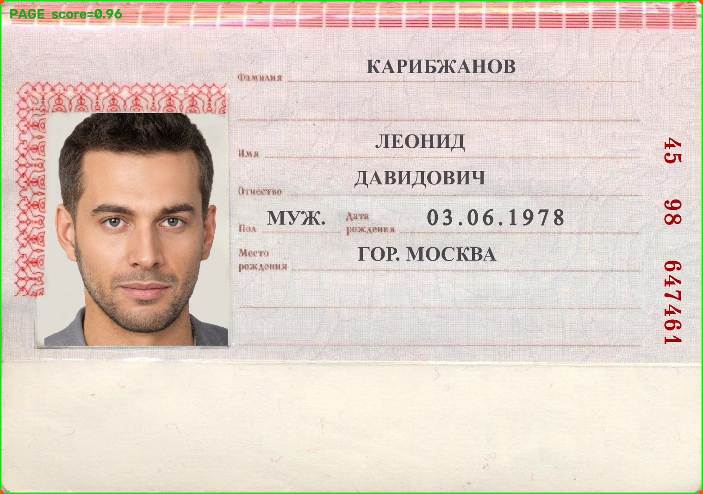

# Распознавание страницы паспорта

Небольшой прототип: ищет третью страницу синтетического паспорта, распознаёт поля и возвращает их в JSON. Программа настроена на один макет.

## Запуск

```powershell
python -m pip install -r requirements.txt
python -m streamlit run src/main.py
```

После запуска загрузи изображение в открывшийся интерфейс. При первом запуске OCR может скачать файлы модели.

Одно изображение можно обработать из командной строки:

```powershell
python src/extract_passport_fields.py data/opensource_selection/good/001.png
```

## Примеры работы

Найденная страница и распознанные поля:



Результат обработки этой картинки:

```json
{
  "found": true,
  "page_score": 0.96,
  "fields": {
    "surname": "КАРИБЖАНОВ",
    "first_name": "ЛЕОНИД",
    "patronymic": "ДАВИДОВИЧ",
    "sex": "МУЖ.",
    "birth_date": "03.06.1978",
    "birth_place": "ГОР. МОСКВА",
    "passport_series_number_raw": "45 98 647461",
    "passport_series": "4598",
    "passport_number": "647461"
  },
  "input": "data\\opensource_selection\\good\\001.png"
}
```
